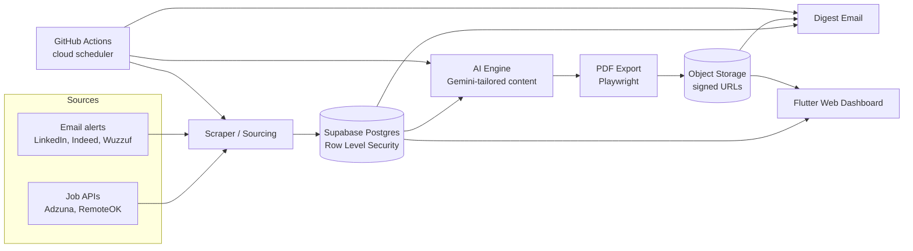

# Accepted

**An automated, AI-powered job outreach platform.** It sources fresh job postings, tailors a CV and an HR cover letter for each one, exports them to PDF, and notifies the candidate with a one-click apply flow — reducing a job search from dozens of manual, repetitive steps to a short daily review.

Built multi-tenant and subscription-ready from day one: every table is scoped to `user_id` with Postgres Row Level Security, so the architecture doesn't need a rewrite to go from "one user" to "paying customers."

## Why this exists

I built Accepted to automate my own job search across multiple career tracks (UI/UX Design, Flutter Development) at once — each with its own titles, target locations, and a CV tailored to that track's story, not one generic document sent everywhere. What started as a personal tool is designed to become a small SaaS product other job seekers can subscribe to.

## What's built and working today

**Sourcing**
- Pulls postings from official job APIs (Adzuna, RemoteOK) and parses the user's own job-alert emails (LinkedIn, Indeed, Wuzzuf) — no ToS-violating scraping.
- Deduplicates the same real posting arriving from two different sources under two different URLs.
- Filters out postings that are stale or geographically unreachable (onsite roles with no realistic visa/relocation path) *before* they ever reach the AI step, so a scarce daily generation budget is never spent on an application the candidate can't actually make.

**AI tailoring (Gemini)**
- Strict anti-hallucination prompt design: the model may only select, reorder, and rephrase facts it's explicitly given — it cannot invent a skill, employer, project, or achievement. Every generation is grounded in the candidate's real, structured profile data.
- Structured JSON output (not free text) for summary, per-role bullets, ATS keywords, and cover-letter paragraphs, so rendering is deterministic and safe to template.
- Rate-limit aware: tracks usage against the API's quota and stops cleanly rather than failing mid-batch or mislabeling untried jobs as failures.

**Documents**
- Every profile link (portfolio, GitHub, LinkedIn, Behance) and every per-project link is verified reachable via a live HTTP check *before* it's embedded — a CV never ships with a dead or wrong link.
- HTML → PDF export (headless Chromium via Playwright), uploaded to object storage with a signed, time-limited, custom-named download URL per document.

**Notification & apply flow**
- A digest email with each newly tailored job, its apply link, and both documents.
- A single "Apply Now" action in the dashboard downloads both PDFs and opens the job's apply page together.

**Dashboard**
- Flutter web app, bilingual (Arabic/English, full RTL support), for reviewing sourced jobs, tracking status per application, and editing search settings — no redeploy needed to change what's being searched for.

**Automation & infrastructure**
- Runs on a cloud cron (GitHub Actions), not a machine that has to stay on — a lightweight gate checks whether the user's configured interval has actually elapsed before doing any real work, so the effective cadence stays user-configurable even though the underlying trigger is fixed.
- Multi-tenant Postgres schema (Supabase) with Row Level Security on every table, and an `is_admin`/quota-ready `profiles` table already shaped for subscription tiers.

## Architecture

## Tech stack

| Layer | Technology |
|---|---|
| Backend / pipeline | Python |
| AI | Google Gemini (structured JSON output) |
| PDF generation | Playwright (headless Chromium) |
| Database & Auth | Supabase (Postgres, Row Level Security, Storage) |
| Frontend | Flutter Web (Material 3, `flutter_localizations`) |
| Hosting | Firebase Hosting |
| Scheduling / CI | GitHub Actions |

## Roadmap — becoming a full SaaS product

Not yet built — the schema and architecture were designed for this from the start, but none of it is live yet:

- Free trial period on signup, then paid subscription tiers with different monthly CV-generation quotas.
- Payment integration (Stripe or Paddle) with a webhook-driven billing state, no card data touching the app itself.
- Self-service sign-up and a guided onboarding flow for a new user's profile, target tracks, and preferences (remote/hybrid/onsite, full-time/part-time).
- Per-user quota enforcement, replacing today's single-account usage tracking.

## Built by

Yosra Mohsen Shehata — Product Designer & Flutter Developer.
