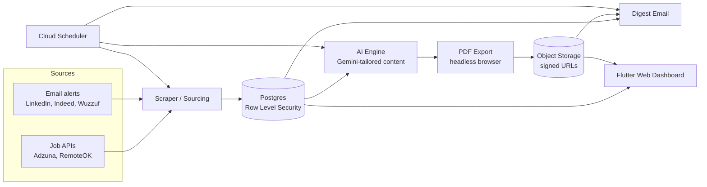

# Accepted

**An automated, AI-powered job outreach platform.** It sources fresh job postings, tailors a CV and an HR cover letter for each one, exports them to PDF, and notifies the candidate with a one-click apply flow — reducing a job search from dozens of manual, repetitive steps to a short daily review.

Built multi-tenant and subscription-ready from day one: every table is scoped to `user_id` with Postgres Row Level Security, so the architecture doesn't need a rewrite to go from "one user" to "paying customers."

## Why this exists

I built Accepted to automate my own job search across multiple career tracks (UI/UX Design, Flutter Development) at once — each with its own titles, target locations, and a CV tailored to that track's real story, not one generic document sent everywhere. What started as a personal tool is designed from the ground up to become a small SaaS product other job seekers can subscribe to.

## Pipeline walkthrough

1. **Source** — every run pulls fresh postings from official job APIs and parses whatever job-alert emails have arrived since the last check, normalizing them all into one shared schema regardless of where they came from.
2. **Filter** — before anything reaches the AI, postings are checked for two things: is it actually recent (using the source's own posting date when it exposes one, not just when *we* happened to see it), and is it somewhere the candidate could realistically start work (remote, or onsite somewhere with no visa/relocation blocker)? Everything else is skipped, honestly, with a reason attached — never silently dropped.
3. **Tailor** — for each surviving posting, the candidate's real profile (per career track) and the job description go to Gemini under a response schema that forces structured, factual output: a summary, reordered skills, per-role bullets, matched ATS keywords, and cover-letter paragraphs — nothing the model wasn't explicitly given.
4. **Export** — the tailored content is rendered into an HTML CV and cover letter, then converted to PDF with a headless browser and uploaded to object storage behind a signed, time-limited, descriptively-named download link.
5. **Notify** — a digest email goes out with the job, its apply link, and both documents.
6. **Apply** — from the dashboard, one action downloads both PDFs and opens the job's apply page together; the candidate reviews and submits by hand, keeping a human in the loop before anything is sent to an employer.

## What's built and working today

**Sourcing**
- Pulls postings from official job APIs (Adzuna, RemoteOK) and parses the user's own job-alert emails (LinkedIn, Indeed, Wuzzuf) via IMAP — no ToS-violating scraping of the job sites themselves.
- Deduplicates the same real posting arriving from two different sources under two different URLs, so it's never tailored and sent twice.
- Filters out postings that are stale or geographically unreachable *before* they ever reach the AI step, so a scarce daily generation budget is never spent on an application the candidate can't actually make.

**AI tailoring**
- Strict anti-hallucination prompt design: the model may only select, reorder, and rephrase facts it's explicitly given — it cannot invent a skill, employer, project, or achievement.
- Structured JSON output (not free text) for summary, per-role bullets, ATS keywords, and cover-letter paragraphs, so downstream rendering is deterministic and safe to template.
- Rate-limit aware: tracks usage against the API's quota and stops cleanly rather than failing mid-batch or mislabeling untried jobs as failures.

**Documents**
- Every profile link (portfolio, GitHub, LinkedIn, Behance) and every per-project link is verified reachable via a live HTTP check *before* it's embedded — a CV never ships with a dead or wrong link.
- HTML → PDF export via a headless browser, uploaded to object storage with a signed, time-limited, custom-named download URL per document.

**Notification & apply flow**
- A digest email with each newly tailored job, its apply link, and both documents.
- A single "Apply Now" action in the dashboard downloads both PDFs and opens the job's apply page together — implemented without relying on multiple browser pop-ups, which most browsers block past the first one per click.

**Dashboard**
- Flutter web app, bilingual (Arabic/English, full RTL support), for reviewing sourced jobs, tracking status per application, and editing search settings — no redeploy needed to change what's being searched for.

**Automation & infrastructure**
- Runs on a cloud cron, not a machine that has to stay powered on — a lightweight gate checks whether the user's configured interval has actually elapsed before doing any real work, so the effective cadence stays user-configurable even though the underlying trigger is fixed.
- Multi-tenant Postgres schema with Row Level Security on every table, and a quota-ready profiles table already shaped for subscription tiers.

## Architecture



## Project structure

```
automation/
├── scrapers/
│   ├── apis/            # Adzuna, RemoteOK API clients
│   └── email_alerts/    # IMAP fetch + per-source HTML parsers (LinkedIn, Indeed, Wuzzuf)
├── ai_engine/
│   ├── content_prompt.py    # the anti-hallucination Gemini prompt + response schema
│   ├── gemini_client.py     # API call + structured JSON parsing
│   ├── link_verification.py # reachability check before any link is embedded
│   ├── render.py            # fills the HTML templates from tailored content
│   ├── pdf_export.py        # headless-browser HTML -> PDF
│   ├── storage.py           # uploads to object storage
│   └── templates/           # CV + cover letter HTML/CSS
├── outreach/
│   └── digest.py         # daily/interval digest email
├── sql/                   # one file per schema migration, applied in order
├── scheduler_gate.py      # decides whether it's actually time to run yet
├── run_pipeline.py        # single entrypoint: source -> tailor -> notify
└── config.py              # all configuration from environment variables, nothing hardcoded

lib/
├── models/       # typed data classes (Job, AutomationSchedule, ...)
├── services/     # Supabase/storage access, one class per concern
├── screens/      # top-level pages (Jobs, Settings)
├── widgets/      # reusable UI pieces (JobCard, ScheduleSettingsCard, ...)
├── theme/        # colors, typography
└── l10n/         # Arabic + English translations (ARB files)
```

## Tech stack

| Layer | Tools | Why |
|---|---|---|
| Backend / pipeline | Python, `requests`, `BeautifulSoup` | Simple, dependency-light HTTP + HTML parsing for API clients and email-alert parsing |
| AI | Google Gemini, structured JSON schema output | Forces factual, parseable output instead of free-text the app would have to re-parse and trust |
| Templating & PDF | `Jinja2`, Playwright (headless Chromium) | HTML/CSS is easier to design and iterate on than a PDF library's drawing API; Playwright renders it pixel-faithfully |
| Email | `smtplib` / `imaplib` (stdlib) | No extra dependency needed for straightforward SMTP send / IMAP fetch |
| Database, Auth & Storage | Supabase (Postgres, Row Level Security, Storage, Auth) | Real Postgres (not a proprietary NoSQL store) with RLS enforced at the database layer, not just in application code |
| Frontend | Flutter Web, Material 3, `flutter_localizations` | One codebase for a bilingual, RTL-aware dashboard; no separate state-management library — `StatefulWidget`/`FutureBuilder` is enough for this app's actual scope |
| Hosting | Firebase Hosting | Free, simple static hosting for a Flutter web build |
| Scheduling / CI | GitHub Actions | Cloud-native cron with secrets management built in, no server to provision or maintain |

## Code highlights

A few real excerpts that show the engineering decisions behind the project, not just what the code does.

**Security enforced at the database, not the app**
```sql
create policy "owner access target_jobs" on target_jobs
  for all to authenticated
  using (auth.uid() = user_id)
  with check (auth.uid() = user_id);
```
Every table carries a policy like this. A bug in a Python script or a Flutter screen can never leak one user's data to another — the database itself refuses the query.

**An AI prompt designed to make hallucination structurally impossible**
```python
1. You may ONLY use facts given in CANDIDATE DATA below. Never invent, assume, or add any skill, tool,
   employer, project, achievement, or credential that is not explicitly listed there — not even something
   "reasonable" or "likely true" for someone with this background. If the job wants something not present
   in CANDIDATE DATA, simply don't claim it.
```
Paired with a strict JSON response schema (never free text) and a separate, non-AI link-verification step, the model only ever selects and rephrases real facts — it never gets a chance to invent one.

**Real-world edge cases, not textbook happy paths**
```python
# Sites like LinkedIn (custom 999) and Behance (403) block scripted requests
# outright, even for a real, correctly-typed profile URL — confirmed live
# against real profile links, which return these codes despite being valid.
# Treating them as "broken" would wrongly strip real links from every CV.
DEAD_LINK_STATUS_CODES = {404, 410}
```
Found by testing against real profile URLs, not assumed from documentation — only a genuine dead-link signal is treated as broken.

**Solving "the schedule has to survive the laptop being off"**
```python
def should_run_now(supabase) -> tuple[bool, str | None]:
    row = supabase.table("automation_settings") \
        .select("user_id, run_interval_minutes, last_run_at") \
        .limit(1).maybe_single().execute().data
    if not row or not row.get("last_run_at"):
        return True, row["user_id"] if row else None

    last_run = datetime.fromisoformat(row["last_run_at"].replace("Z", "+00:00"))
    elapsed_minutes = (datetime.now(timezone.utc) - last_run).total_seconds() / 60
    return elapsed_minutes >= row["run_interval_minutes"], row["user_id"]
```
The cloud scheduler only offers a fixed cron, so this checks elapsed time against a user-configurable interval on every trigger — the schedule stays adjustable from the dashboard even though the underlying trigger can't be.

## Roadmap — becoming a full SaaS product

Not yet built — the schema and architecture were designed for this from the start, but none of it is live yet:

- Free trial period on signup, then paid subscription tiers with different monthly CV-generation quotas.
- Payment integration (Stripe or Paddle) with a webhook-driven billing state, no card data touching the app itself.
- Self-service sign-up and a guided onboarding flow for a new user's profile, target tracks, and preferences (remote/hybrid/onsite, full-time/part-time).
- Per-user quota enforcement, replacing today's single-account usage tracking.

## Screenshots

*(coming soon)*

## Built by

Yosra Mohsen Shehata — Product Designer & Flutter Developer.
